# Setting up Nimbus

This is the "explain it like I'm not a developer" guide. Read **Part 1** start to
finish and you will have Nimbus producing a real optimisation plan. Read **Part 2**
later, when you want more out of it.

- **Part 1 — Basic.** The smallest set of steps that gets Nimbus solving. Five
  required fields, nothing else. Most people should stop here for the first week.
- **Part 2 — Advanced.** Everything else: dashboards, per-appliance learning,
  controllable loads Nimbus physically switches, EVs, the daily quality score,
  price events, tuning.

If you want the exhaustive field-by-field table instead, see
[`configuration-reference.md`](configuration-reference.md). That one is for looking
things up; this one is for doing it the first time.

Nothing here is simplified to the point of being wrong. Every field name, default,
warning and expected value below matches the real code.

> **About the images.** Every screenshot here is a real capture from a live
> install, not a mock-up, so the numbers in them are real numbers — yours will
> differ. The surrounding text is written to stand on its own, so you can follow
> every step without relying on an image.

---

## Contents

**Part 1 — Basic**
1. [What Nimbus is, in one minute](#1-what-nimbus-is-in-one-minute)
2. [What you need before you start](#2-what-you-need-before-you-start)
3. [Install it](#3-install-it)
4. [Add the integration](#4-add-the-integration)
5. [Create the forecast the Solver needs](#5-create-the-forecast-the-solver-needs) ← *the step everyone skips*
6. [Run the Solver settings wizard](#6-run-the-solver-settings-wizard)
7. [Set your real battery and grid numbers](#7-set-your-real-battery-and-grid-numbers) ← *the step that silently ruins plans*
8. [Check it actually worked](#8-check-it-actually-worked)
9. [Put a dashboard on it](#9-put-a-dashboard-on-it)
10. [What "working" looks like after a week](#10-what-working-looks-like-after-a-week)

**Part 2 — Advanced**
11. [Forecaster settings — make the learning better](#11-forecaster-settings--make-the-learning-better)
12. [Loads — learn one appliance at a time](#12-loads--learn-one-appliance-at-a-time)
13. [Controllable loads — let Nimbus switch things](#13-controllable-loads--let-nimbus-switch-things)
14. [Battery participants — a second battery or an EV](#14-battery-participants--a-second-battery-or-an-ev)
15. [The daily quality score](#15-the-daily-quality-score)
16. [The topology diagram](#16-the-topology-diagram)
17. [Tuning knobs](#17-tuning-knobs)
18. [Optional inputs](#18-optional-inputs)
19. [Services you can call](#19-services-you-can-call)
20. [Actually driving your battery with the plan](#20-actually-driving-your-battery-with-the-plan)

**Reference**
- [Troubleshooting](#troubleshooting)
- [Every check in one place](#every-check-in-one-place)
- [Removing Nimbus](#removing-nimbus)

---

# Part 1 — Basic

## 1. What Nimbus is, in one minute

Nimbus does two separate jobs. You can use either on its own.

**The Forecaster** watches power sensors you already have and learns your
household's habits. After a couple of weeks it knows things like "the pool pump
draws 1.2 kW between 8am and 3pm" without you typing any of that in.

**The Solver** takes those forecasts plus your real electricity prices and works
out the cheapest plan: when to charge the battery, when to discharge, when to
import, when to export. It re-plans continuously and publishes the result as
sensors.

### What Nimbus does and does not control

This matters, so it is stated plainly rather than buried:

| | |
|---|---|
| **Your battery / inverter** | Nimbus **publishes a plan**. It never commands your inverter itself. If you want the plan to actually move your battery, *you* write a Home Assistant automation that reads the plan sensor and commands your hardware — see [§20](#20-actually-driving-your-battery-with-the-plan). |
| **Controllable loads** (hot water, pool pump, aircon) | Nimbus **does** command these directly — but only `switch`, `water_heater` and `climate` entities, and only if you explicitly set a "Device to command" on a Controllable Load. See [§13](#13-controllable-loads--let-nimbus-switch-things). |
| **Everything else** | Nimbus only reads. |

So out of the box, after Part 1, **Nimbus changes nothing in your house.** It
watches and it plans. That is deliberate — you get to look at its plans for a
while and decide whether you trust them before anything acts on them.

### Brand independence

Nimbus does not care what inverter, battery or retailer you have. Everywhere it
needs a number — battery charge level, current price, solar output — it asks you
to point it at whatever sensor already exists in your Home Assistant. If your
inverter's integration shows a battery percentage, Nimbus can use it.

---

## 2. What you need before you start

**Required:**

- **Home Assistant** with HACS installed.
- **A battery with a State-of-Charge sensor** (a `sensor.*` reading 0–100 %).
- **An import price sensor and an export price sensor** ($/kWh). Amber,
  LocalVolts, Tibber, or a template sensor you wrote yourself — anything works,
  including a fixed-value template sensor if you are on a flat tariff.
- **A solar forecast** from some integration (Solcast, Open-Meteo Solar Forecast,
  Forecast.Solar — any of them).
- **A whole-house power sensor** (kW or W). Nimbus builds the household load
  forecast from this itself.

**Strongly recommended:**

- **Recorder actually recording those sensors** for at least a few days. Nimbus
  learns from Recorder history. Day one it works but is rough — that is normal,
  not broken.

**Architecture note:** Nimbus needs `highspy`, a compiled linear-programming
solver. Home Assistant installs it automatically, but prebuilt wheels exist only
for **amd64 and aarch64** — a 64-bit Intel/AMD box, a Raspberry Pi 4/5 on a
64-bit OS, most NUCs and VMs. On 32-bit ARM (`armv7`, older Pi OS installs) there
is no wheel and the Solver will not start. The Forecaster still works fine.

### A note on required fields

Every Nimbus screen marks genuinely required fields with a **🔴** and says
"🔴 = required" in its own description. **Everything without a 🔴 can be left
blank.** Several screens have fifteen-plus fields and only two of them matter. Do
not fill in fields just because they are there.

---

## 3. Install it

1. Open **HACS**.
2. Three-dot menu, top right → **Custom repositories**.
3. Repository: `https://github.com/code-imstillalive/nimbus`
   Type/Category: **Integration**. Click **Add**.
4. Search HACS for **Nimbus**, open it, click **Download**.
5. **Restart Home Assistant** (Settings → System → top-right power icon →
   Restart Home Assistant).

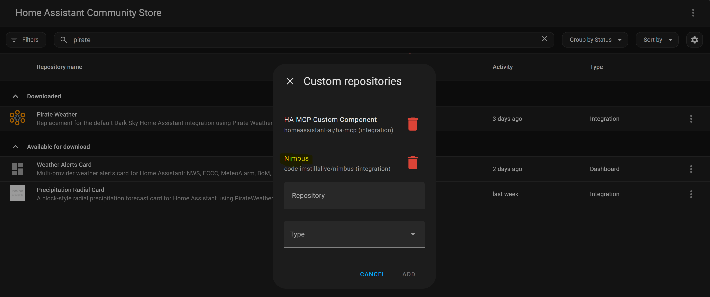

*Paste the URL into **Repository**, set **Type** to **Integration**, then **ADD**. Once added it appears in the list, as shown.*

**Expected outcome:** after the restart, Nimbus appears in Settings → Devices &
Services → **Add Integration** search.

> ⚠️ **A restart is genuinely required, not a reload.** Nimbus is a Python
> integration; Home Assistant can only load new Python on a full restart.

---

## 4. Add the integration

1. **Settings → Devices & Services → + Add Integration**.
2. Search **Nimbus**, click it.
3. The dialog is titled **"Set up Nimbus"** and has **no fields** — it only
   creates the Nimbus hub, the device everything else attaches to. Click
   **Submit**.

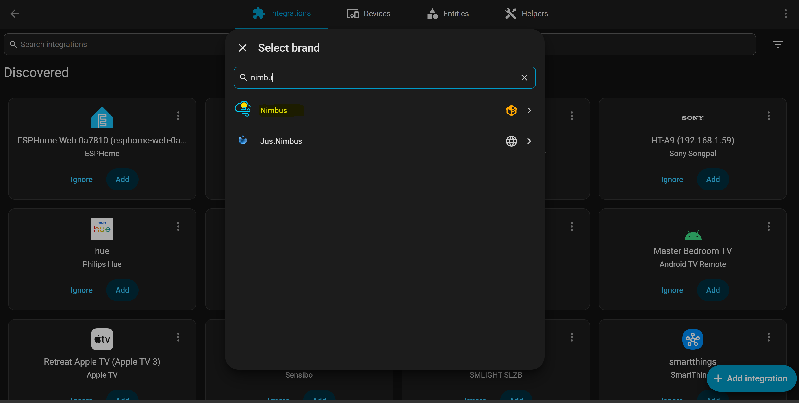

> ⚠️ **Pick the one with the cloud-and-sun icon, named exactly “Nimbus”.**
> Searching `nimbu` also returns **JustNimbus**, a completely unrelated integration for JustNimbus solar hardware. They are different products that happen to sort together. The Nimbus entry shows a local-package icon; JustNimbus shows a globe.

**Expected outcome:** you land on the Nimbus device page, and a **persistent
notification** appears pointing you at Configure → Solver settings. That
notification is not an error — it exists because of the trap in [§7](#7-set-your-real-battery-and-grid-numbers).

On the Nimbus integration page, two things matter:

- **The `+` buttons along the top** — one per thing you can add (Load, Power
  Signal, Controllable Load, Battery Participant, and three diagram-only types).
  This guide writes these as **"+ Add → Power Signal"** and so on.
- **The gear icon on the `Nimbus` hub row** — settings that apply to everything at
  once. This guide calls it **Configure**, which is what Home Assistant calls it
  elsewhere.

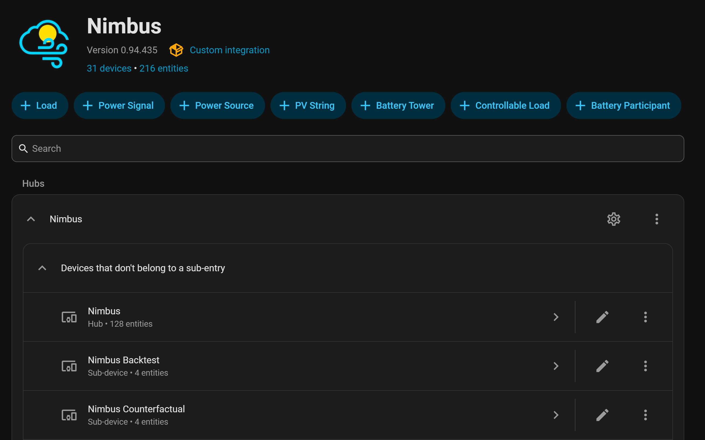

*The Nimbus integration page. The **seven `+` buttons** across the top are how you
add everything — Load, Power Signal, Power Source, PV String, Battery Tower,
Controllable Load, Battery Participant. The **gear icon** on the `Nimbus` hub row
(right-hand side) is what this guide calls **Configure**. Sub-devices like Backtest
and Counterfactual appear on their own as Nimbus creates them; you never add those
yourself.*

> ℹ️ If you only want **load forecasting** and no optimisation at all, you can stop
> after [§12](#12-loads--learn-one-appliance-at-a-time) and never touch the Solver.
> Nothing breaks.

---

## 5. Create the forecast the Solver needs

**Do this before the Solver wizard.** This is the step people skip, and skipping
it is why the Solver wizard then looks impossible to finish.

The Solver needs a **household load forecast**. Nimbus makes one for you — but you
have to create it first, as a **Power Signal**. The Solver wizard asks you to pick
it, and if it does not exist yet there is nothing in the dropdown.

### Create the whole-house load signal

1. On the Nimbus device page: **+ Add → Power Signal**.
2. Dialog: **"Add a power signal"**.
3. **🔴 Sensor to forecast** → your **whole-house power sensor**.
4. **Role** → leave as **Other**. (Role only affects the topology diagram.)
5. Submit.

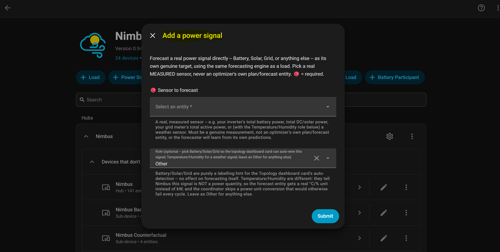

*Pick your real whole-house power sensor under **Sensor to forecast**, and leave **Role** as **Other**. Note the help text: it must be a genuine MEASUREMENT, never another optimiser's plan or forecast entity.*

**Expected outcome:** a new sensor named after your source:
`sensor.nimbus_<your_sensor_name>_forecast`. The name is derived from your source sensor's own name, so a
whole-house sensor called `house_total_power` produces a Nimbus forecast entity
ending `_house_total_power_forecast`.

> ⚠️ **It will read `unknown` for a few minutes.** Nimbus has to train a model
> against your Recorder history first. That is expected. If it is still `unknown`
> after ~15 minutes, see [Troubleshooting](#troubleshooting).

### Optionally, a solar signal

If your solar forecast integration already gives you a forecast sensor (Solcast
etc.), you do **not** need this — use theirs. Only add a Power Signal for solar if
you want Nimbus to forecast your inverter's DC power itself.

### The two traps on this screen

> ⚠️ **Never point a Power Signal at an optimiser's plan entity.** Use real,
> measured sensors only. Point it at HAEO's, EMHASS's or Nimbus's own output and
> the model learns from its own predictions, and the forecast slowly becomes
> nonsense.

> ⚠️ **Never use `sensor.nimbus_household_load_total_forecast` as a source for
> anything.** That entity is the Solver's *output* roll-up, not an input. Pointing
> the Solver's load field at it creates a loop that produces a confident-looking
> plan built on "nobody in this house uses any power". A real install lost about
> **$46 in a day** to exactly this, with every health field still green. Nimbus now
> rejects this case automatically, but the cleanest fix is not to do it.

---

## 6. Run the Solver settings wizard

**Nimbus integration page → the gear icon on the `Nimbus` hub row.**

You get a menu, **"Nimbus settings"**, with three options:

| Menu option | Do it now? |
|---|---|
| Forecaster settings (shared sensors + tuning) | **No** — entirely optional, [§11](#11-forecaster-settings--make-the-learning-better) |
| **Solver settings (your real battery/grid/solar setup)** | **Yes — this one** |
| Topology diagram settings | **No** — cosmetic, [§16](#16-the-topology-diagram) |

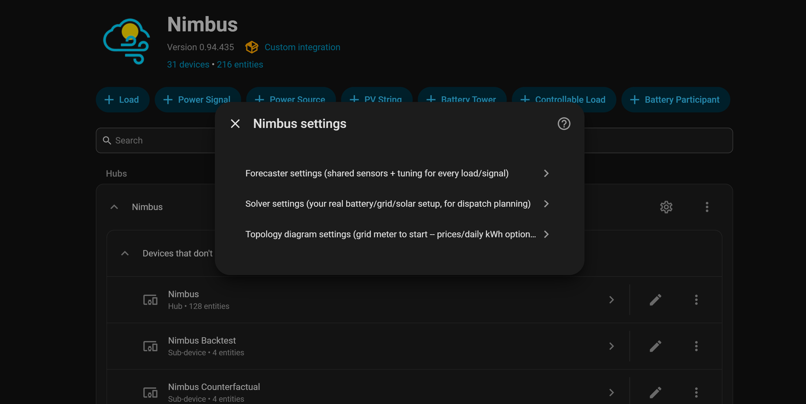

*The **Nimbus settings** menu, reached from the gear icon. Three options, and only
the middle one matters for Part 1.*

Pick **Solver settings**. It is a three-screen wizard.

### Screen 1 of 3 — "Solver: Battery"

**Exactly one required field.**

| Field | What to put |
|---|---|
| **🔴 Battery State of Charge sensor (%)** | Your inverter's own live SoC sensor. A real 0–100 % measurement, not a target or setpoint. |
| Live max-discharge setpoint entity | **Leave blank.** Correct for almost every install. |

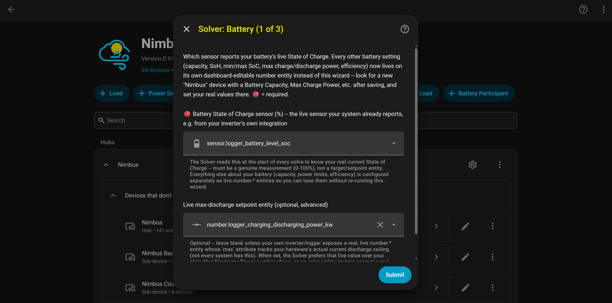

> ℹ️ **Where is capacity? Where are the power limits?** Not here. They are live
> `number.*` entities you edit from the dashboard instead — that is
> [§7](#7-set-your-real-battery-and-grid-numbers), and you must not skip it.

### Screen 2 of 3 — "Solver: Grid Prices"

**Two required fields.** There are ten on screen; ignore the other eight.

| Field | What to put |
|---|---|
| **🔴 Live import (buy) price sensor ($/kWh)** | What you pay to import, right now. |
| **🔴 Live export (sell) price sensor ($/kWh)** | What you are paid to export, right now. |
| Everything else (2nd/3rd price sources, price-event simulation, DNSP envelopes) | **Leave blank.** [§18](#18-optional-inputs) |

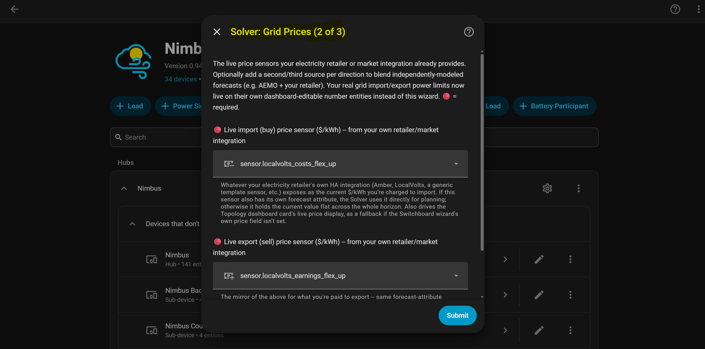

> ℹ️ **On a flat tariff?** Make two template sensors with your fixed rates and point
> these at them. Nimbus still earns its keep on solar self-consumption and battery
> cycling; it just has less to work with.
>
> ℹ️ **If your price sensor has its own `forecast` attribute**, Nimbus uses it
> automatically for forward planning. If not, it holds the current price flat across
> the horizon. Both work; the first works better.

### Screen 3 of 3 — "Solver: Solar & Load Forecasts"

**Two required fields out of sixteen.**

| Field | What to put |
|---|---|
| **🔴 Solar generation forecast sensor** | Your Solcast / Open-Meteo / Forecast.Solar sensor. |
| **🔴 Household load forecast sensor** | **The Power Signal you made in [§5](#5-create-the-forecast-the-solver-needs)** — `sensor.nimbus_<your_sensor>_forecast`. |
| *Optional: individual circuit forecast sensors* | **Leave completely blank.** See the warning below. |
| Everything else | **Leave blank.** [§15](#15-the-daily-quality-score) and [§18](#18-optional-inputs) cover them. |

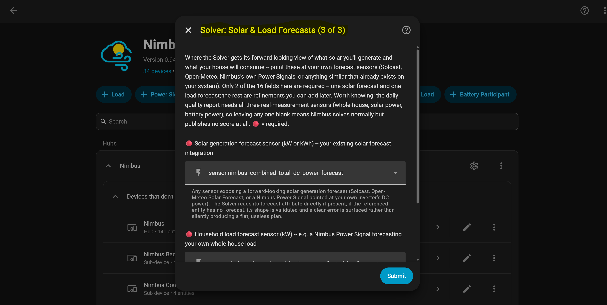

> ⚠️ **The silent-override trap.** "Individual circuit forecast sensors" **beats**
> "Household load forecast sensor" outright the moment it has even one entry — no
> warning, no error. If you ever experiment with it and change your mind, you must
> **empty it completely**, or it keeps winning and you will not be told.

Submit. **Expected outcome:** the dialog closes and a batch of new
`number.nimbus_solver_*` entities exists on the Nimbus device.

---

## 7. Set your real battery and grid numbers

**This is the single most important step in this guide, and the easiest to miss.**

Every numeric Solver setting — capacity, charge/discharge limits, grid limits,
efficiency, costs — lives on its own `number.*` entity, **not** in the wizard. They
all start at a **defensive placeholder minimum**: battery capacity starts at
**0.1 kWh**.

**A 0.1 kWh battery solves perfectly happily and produces a completely useless
plan.** No error. No warning. The plan just quietly assumes you have almost no
battery.

### Set these now

On the Nimbus device page (or Settings → Devices & Services → Nimbus → entities):

| Entity | Set it to |
|---|---|
| `number.nimbus_solver_battery_capacity_kwh` | Your battery's real **usable** capacity in kWh |
| `number.nimbus_solver_max_charge_kw` | Real max charge power |
| `number.nimbus_solver_max_discharge_kw` | Real max discharge power |
| `number.nimbus_solver_grid_max_import_kw` | Your main breaker / connection import limit |
| `number.nimbus_solver_grid_max_export_kw` | Your approved export limit |
| `number.nimbus_solver_battery_min_soc_percent` | Your floor, e.g. `10` |
| `number.nimbus_solver_battery_max_soc_percent` | Your ceiling, e.g. `100` |
| `number.nimbus_solver_efficiency_percent` | Round-trip efficiency, e.g. `90` |
| `number.nimbus_solver_battery_soh_percent` | State of health, `100` if new |

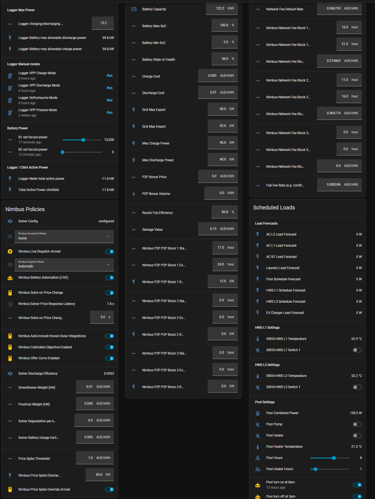

*Every setting in this step is an ordinary `number.*` entity, so you can put them
all on one dashboard and edit them inline — no wizard, no restart. This is a
fully-populated example: capacity, SoC floor/ceiling, charge and discharge limits,
grid limits, efficiency and the economic costs, alongside the network-fee blocks
and scheduled loads from Part 2.*

> ℹ️ **Usable, not nameplate.** If you have a 10 kWh pack the manufacturer only lets
> you use 9 kWh of, enter 9. You can instead leave capacity at nameplate and carve
> out the reserve with `min_soc_percent` / `max_soc_percent` — just do not do both,
> or you double-count.

> ℹ️ Every one of these is live-editable forever. You never need to re-run the wizard
> to change a number.

---

## 8. Check it actually worked

Open **Developer Tools → States**. This is the whole acceptance test.

| # | Entity | Expected | If it is wrong |
|---|---|---|---|
| 1 | `sensor.nimbus_solver_config` | **`configured`** | Wizard did not complete — re-run [§6](#6-run-the-solver-settings-wizard) |
| 2 | `sensor.nimbus_solver_lp_status` | **`optimal`** | See [Troubleshooting](#troubleshooting) |
| 3 | `sensor.nimbus_solver_solve_seconds` | a number, typically **0.5–3** | If absent, the Solver never ran |
| 4 | `sensor.nimbus_solver_battery_forecast` | a kW number with a long `forecast` attribute | If `unknown`, no plan yet |

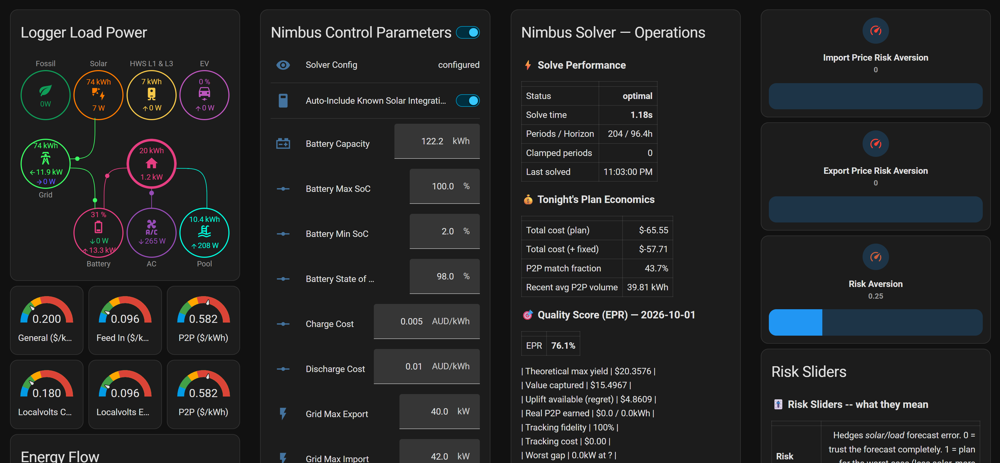

*The same acceptance test, as a dashboard instead of Developer Tools. **Solver
Config: configured**, **Status: optimal**, solve time **1.18 s**, **204 periods /
96.4 h** horizon — and the live `number.*` parameters on the left showing real
values rather than placeholders (Battery Capacity **122.2 kWh**, not `0.1`).*

**`lp_status: optimal` is the one that means "it is working."** It means the
optimiser found a real, feasible, cost-minimal plan.

### Sanity-check the plan is about *your* house

| Entity | Should look like |
|---|---|
| `sensor.nimbus_solver_current_soc_pct` | your battery's real charge level right now |
| `sensor.nimbus_solver_current_load_kw` | your real household draw right now |
| `sensor.nimbus_solver_current_import_price` | your real current buy price |
| `sensor.nimbus_solver_horizon_hours` | how far ahead it planned, typically ~96 |
| `sensor.nimbus_solver_binding_constraint_now` | a plain-English sentence, e.g. *"Grid export at zero (not economical right now)"* |

`binding_constraint_now` is the most useful single sensor in Nimbus. It tells you
**why** the plan is doing what it is doing, in words.

### A paste-ready template check

Developer Tools → **Template**, paste this:

```jinja
Config:      {{ states('sensor.nimbus_solver_config') }}
LP status:   {{ states('sensor.nimbus_solver_lp_status') }}
Solve time:  {{ states('sensor.nimbus_solver_solve_seconds') }} s
Periods:     {{ states('sensor.nimbus_solver_n_periods') }}
Horizon:     {{ states('sensor.nimbus_solver_horizon_hours') }} h
Capacity:    {{ states('number.nimbus_solver_battery_capacity_kwh') }} kWh
SoC now:     {{ states('sensor.nimbus_solver_current_soc_pct') }} %
Load now:    {{ states('sensor.nimbus_solver_current_load_kw') }} kW
Why:         {{ states('sensor.nimbus_solver_binding_constraint_now') }}
Health:      {{ states('sensor.nimbus_health_report') }} errors
```

A healthy install returns something like:

```
Config:      configured
LP status:   optimal
Solve time:  1.17 s
Periods:     202
Horizon:     96.3 h
Capacity:    122.2 kWh
SoC now:     97.52 %
Load now:    0.89 kW
Why:         Grid export pinned at 12.00 kW by P2P export commitment
Health:      0 errors
```

**If `Capacity` says `0.1`, go back to [§7](#7-set-your-real-battery-and-grid-numbers).**
That is the most common mistake, and every number above it is meaningless until
you fix it.

---

## 9. Put a dashboard on it

Nimbus ships three custom cards, installed automatically with the integration —
there is nothing to copy into `www/` and no resource to register by hand.

| Card | Shows |
|---|---|
| **Control Panel** (`custom:nimbus-dispatch-card-v4`) | The live plan: what it is doing now, why, prices, SoC, upcoming schedule |
| **Topology** (`custom:nimbus-topology-card`) | An animated diagram of power flowing between solar, battery, house and grid |
| **Regret** (`custom:nimbus-regret-card`) | Yesterday's score — what the plan captured vs what perfect foresight would have |

### The fastest way in

[`dashboards.md`](dashboards.md) has a **complete three-view dashboard you can
copy-paste whole**. Do that rather than building cards one at a time:

1. **Settings → Dashboards → + Add Dashboard** → "New dashboard from scratch".
   Name it **Nimbus**.
2. Open it, pencil icon (top right) → three-dot menu → **Raw configuration editor**.
3. Delete what is there, paste the block from
   [`dashboards.md`](dashboards.md#full-three-view-nimbus-dashboard-copy-paste),
   **Save**.

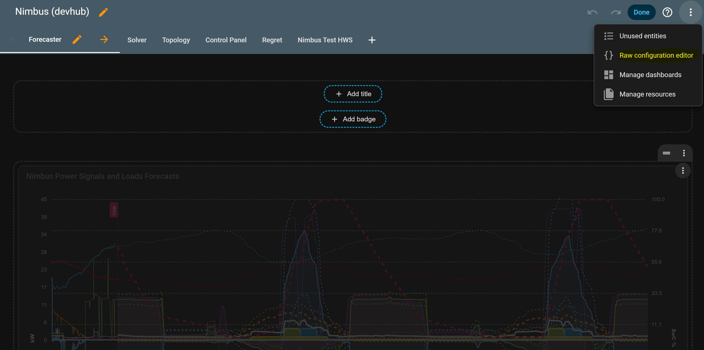

*With the dashboard in edit mode, the ⋮ menu top-right has **Raw configuration editor**. That opens a YAML pane — replace everything in it with the dashboard YAML, then **Save**.*

**Expected outcome:** three views — Control Panel, Topology, Regret.

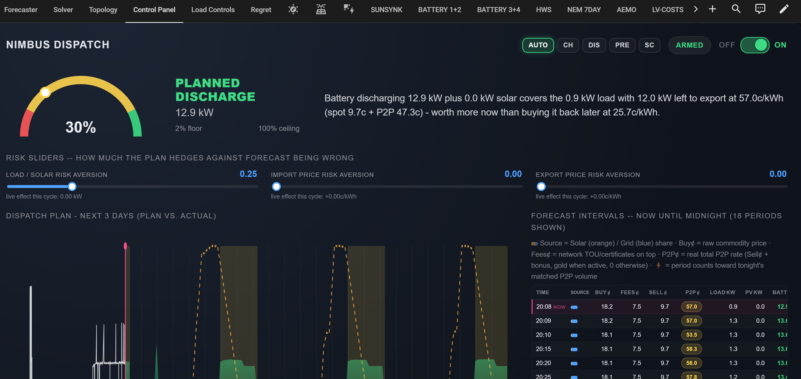

*The **Control Panel** view. It states the decision and the reasoning in plain
English — here, *"Battery discharging 12.9 kW plus 0.0 kW solar covers the 0.9 kW
load with 12.0 kW left to export at 57.0c/kWh (spot 9.7c + P2P 47.3c) — worth more
now than buying it back later at 25.7c/kWh."* The risk sliders are live and
editable, the plan-vs-actual chart and the per-interval price table sit below, and
the ARMED/OFF toggle top-right is the kill switch for your own dispatch automation.*

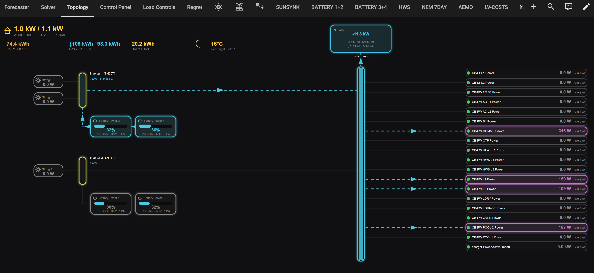

*The **Topology** view on a two-inverter / four-tower system. Each inverter is
named with its real model (here `SH25T` and `SH15T`) and carries its own battery
towers, every tower showing its own SoC / SoH / voltage / temperature. Live power
animates along each active path, every monitored circuit is listed on the right
with its live draw and its Nimbus forecast, and daily solar / battery / load
totals run across the top.*

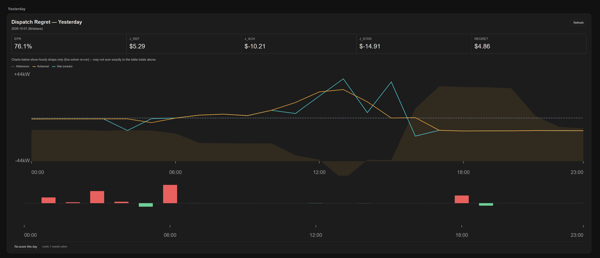

*The **Regret** view. `EPR` is the headline — the share of theoretically-available
value captured. `J_REF` is the do-nothing baseline, `J_ACH` what actually happened,
`J_STAR` what perfect foresight would have achieved, and `REGRET` the gap. The
chart compares all three hour by hour.*

> ⚠️ **"Custom element doesn't exist"?** Hard-refresh the browser (Ctrl-F5 /
> Cmd-Shift-R). The cards are registered by the integration at startup, and the
> browser caches the old resource list. If it persists, restart Home Assistant.

> ℹ️ The Regret view stays empty until the quality score is switched on and has had
> a full day to score — see [§15](#15-the-daily-quality-score). An empty Regret card
> on day one is expected, not broken.

### Other views worth building

The three cards above are what Nimbus ships. The reference household adds a few
ordinary-Lovelace views on top, shown here as ideas rather than as something you
have to reproduce:

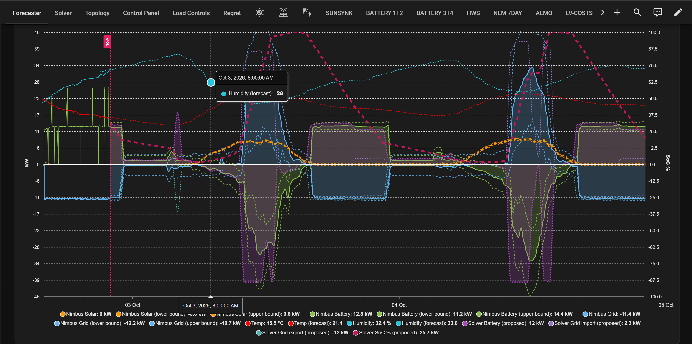

*A **Forecaster** view: every Nimbus forecast on one axis — solar, battery and
grid, each with its upper/lower confidence band — plus temperature and humidity,
and the Solver's own proposed battery/grid trajectory overlaid. The vertical
`now` line separates measured history from forecast.*

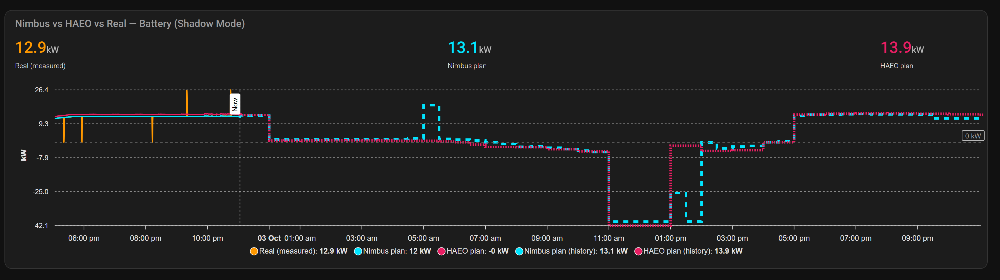

*A **shadow-mode comparison**: what Nimbus plans, against what actually happened,
against whatever optimiser you are migrating from. This is the single most useful
thing to build before you let Nimbus drive anything — it answers "would I have
been better off?" with data instead of opinion, and it costs nothing to run
because Nimbus is only publishing a plan.*

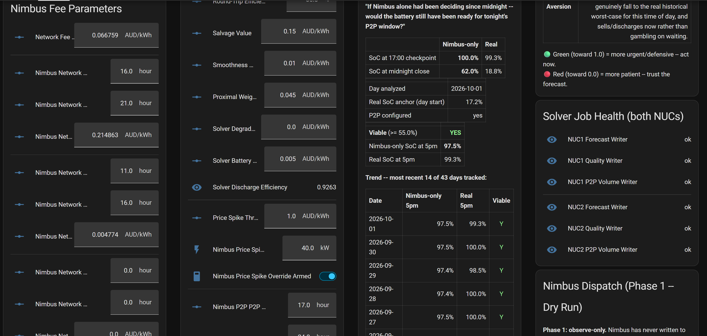

*A **Solver** view carrying the tuning knobs from [§17](#17-tuning-knobs), the
network-fee blocks, and the daily counterfactual — "if Nimbus alone had been
deciding since midnight, would the battery still have been ready?" — with a
multi-day trend of that answer.*

### If you would rather not use the custom cards

Everything Nimbus publishes is a plain sensor, so an ordinary Entities card works:

```yaml
type: entities
title: Nimbus
entities:
  - sensor.nimbus_solver_lp_status
  - sensor.nimbus_solver_current_dispatch_direction
  - sensor.nimbus_solver_binding_constraint_now
  - sensor.nimbus_solver_current_soc_pct
  - sensor.nimbus_solver_current_import_price
  - sensor.nimbus_solver_current_export_price
  - sensor.nimbus_solver_total_cost
  - number.nimbus_solver_battery_capacity_kwh
```

---

## 10. What "working" looks like after a week

- `sensor.nimbus_solver_lp_status` sits at `optimal` essentially always.
- `sensor.nimbus_health_report` state is `0` or low. It counts recent ERROR-level
  log lines; its `recent_errors` / `recent_warnings` attributes hold the detail so
  you never have to open the log file.
- Your forecast sensors stop being jumpy as the models see more history.
- `sensor.nimbus_solver_total_cost` gives the plan's net cost over the horizon.
  **Negative is good** — the plan expects to earn more than it spends.

Once you believe the plans, go to Part 2.

---

# Part 2 — Advanced

Everything below is optional. Add one thing at a time and check
`sensor.nimbus_solver_lp_status` is still `optimal` after each.

## 11. Forecaster settings — make the learning better

**Configure → Forecaster settings.** Every field is optional; submitting it blank
is a complete, working configuration. These apply to *every* load and signal, set
once instead of per-load.

### Context sensors

These are not forecast themselves. They are fed to every model as **context**, so a
model can learn "this load behaves differently when the battery is charging".

| Field | Why bother |
|---|---|
| Temperature sensor | Real gains for anything weather-sensitive — aircon especially |
| Temperature forecast sensor | Point it at your `weather.home` entity directly; Nimbus calls `weather.get_forecasts` for you |
| Humidity sensor | Smaller effect, same idea |
| Battery / Grid / Solar power sensors | System context |
| Curtailment switch | Only if you have a load run specifically to soak up curtailed solar |

> ⚠️ **"Never an optimizer's own plan/forecast"** appears on three of these fields
> and it is not boilerplate. Measured sensors only.

### Tuning

| Field | Default | Change it when |
|---|---|---|
| Forecast horizon (hours) | 48 | The Solver plans ~96 h; raising this costs retrain CPU |
| Retrain at this hour | 3 | Pick a quiet hour — retraining uses real CPU briefly |
| Days of history to train on | 30 | More = steadier, but slower to adapt to a genuine habit change |
| **Training data source** | Recorder history | **See below** |
| Hybrid: recent days | — | Only used when source is Hybrid |

> ⚠️ **The Recorder purge trap.** Default training reads full-resolution Recorder
> history, bounded by your `purge_keep_days`. Keep 10 days, ask for 30, and you
> silently train on 10. Either raise `purge_keep_days`, or switch **Training data
> source** to:
> - **Long-term statistics** — hourly buckets kept indefinitely, so a 90- or
>   365-day retrain always works, at the cost of blurring a load that switches on
>   and off within an hour.
> - **Hybrid** — recent days at full resolution, older days from statistics. The
>   right answer for most people with a short purge window.

## 12. Loads — learn one appliance at a time

**+ Add → Load.** One per circuit or appliance you want forecast individually — hot
water, pool pump, EV charger, a specific breaker. As many as you like.

| Field | Notes |
|---|---|
| **🔴 Power sensor to learn from** | One real circuit/appliance power sensor |
| Fixed schedule start / end hour | Only for a load on a real fixed timer. **24-hour decimal**: `12.5` = 12:30pm |
| Expected power while running (kW) | Only meaningful with a schedule; e.g. `3.7` for a HWS element |

**Expected outcome:** `sensor.nimbus_<name>_forecast` per load, plus the whole-house
roll-up `sensor.nimbus_household_load_total_forecast`.

> ℹ️ **Load vs Power Signal.** A **Load** is one appliance or circuit. A **Power
> Signal** is a whole-system quantity (total battery power, total solar, the grid
> meter). Same engine, different intent. If unsure: one appliance → Load.

## 13. Controllable loads — let Nimbus switch things

**This is the one place Nimbus physically commands your hardware.** Everything else
only reads and plans.

**+ Add → Controllable Load.** Pick a **Kind**:

| Kind | Meaning | Use for |
|---|---|---|
| **Sheddable** | Can be reduced under price pressure, down to an optional floor | Pool heater, a dump load |
| **Deferrable** | Has an energy target and a deadline; Nimbus picks *when* | Hot water, EV charging |
| **Thermal** | A temperature is a **hard guarantee**, not a priced preference | A tank that must hit 60 °C daily |

**Only the fields for your chosen Kind are used — leave the rest blank.**

### The field that makes it act

**"Device to command"** — the entity Nimbus switches:

| Domain | What Nimbus does |
|---|---|
| `switch` | `turn_on` / `turn_off` |
| `water_heater` | `set_operation_mode`: `performance` for on, `eco` for off |
| `climate` | `set_hvac_mode`: your configured mode for on, `off` for off |

Anything else logs a warning and does nothing.

> ⚠️ **Leave "Device to command" blank and Nimbus only plans and scores this load —
> it never touches it.** That is the safe way to try a controllable load first. Fill
> it in once you are happy with the schedule it has been proposing.

> ⚠️ **For a `climate` device you must also set "HVAC mode to command when ON".**
> Nimbus never guesses it from the device's supported modes. Left blank, ON commands
> are skipped with a warning; OFF still works.

### Safety rails worth setting

| Field | Does |
|---|---|
| Minimum hold between commands (minutes) | Stops rapid cycling |
| Max activations per day | Hard cap, whatever the plan wants |
| Re-send command after (minutes) | If the device did not obey, re-send. Default 15; `0` = never. Re-sends do not count against the daily cap |

### Deferrable, the common case

```
Kind:                   Deferrable
Device to command:      water_heater.hws        (or blank to just plan)
Deferrable: max power:  3.7      kW
Deferrable: target:     10       kWh by the deadline
Earliest start:         0        (midnight)
Deadline:               6.5      (6:30am)
Done condition:         >= 60    (tank hits 60 °C → finished early)
```

Two refinements people like:

- **"Run as soon as it's this cheap"** — deliver early whenever price drops below
  your figure, instead of holding out for the single cheapest hour on paper.
- **"Don't wait unless it saves at least $X"** — the only setting in Nimbus allowed
  to override a price signal. Set it so hot water demands a real dollar before it
  will wait, while a pool pump happily chases two cents.

## 14. Battery participants — a second battery or an EV

**+ Add → Battery Participant.** Only for an **additional** battery. Your main
household battery is already configured in Solver settings and is always the `home`
participant — do not add it again.

Core fields: name, capacity, SoC sensor, power sensor, **"Positive reading means
charging"** (check a real reading while it is charging — conventions differ by
vendor), max charge/discharge power, min/max SoC, efficiency.

EV-specific fields worth knowing:

| Field | Does |
|---|---|
| Availability sensor | A `binary_sensor` for "plugged in" / "at home". While off, this participant cannot charge or discharge at all |
| Departure hour + Required SoC by departure | A **hard** requirement — the car will be drivable. Must be set together |
| Live charge-limit entity | The car's own charge-limit slider overrides Max SoC per solve, so changing it in the vehicle app just works |
| Trip calendar | Put the distance in the event title (*"Trip to Brisbane 120 km"*) and Nimbus reserves the energy. Events with no distance are ignored |
| Shared charger group + max kW | Two EVs on one physical charger — stops the plan charging both at full rate |

## 15. The daily quality score

Nimbus can score **yesterday's real dispatch against a perfect-foresight oracle**
and publish `sensor.nimbus_solver_quality_report`. The headline number is **EPR** —
the percentage of theoretically-available value you actually captured. This is what
feeds the **Regret** dashboard view.

**To turn it on**, fill these three in Solver settings screen 3 — **all three, or
there is no score at all**:

1. Household load forecast sensor (already set in Part 1)
2. **Real, measured solar power sensor** — a measurement, not a forecast
3. **Real, measured net battery power sensor**

Plus one checkbox that matters enormously:

> ⚠️ **"Tick ONLY if your battery sensor reports positive = charging."** The common
> convention is positive = discharging; leave it unticked for that. Getting this
> wrong **silently inverts every charge/discharge decision in the score** and
> produces impossible results like a negative EPR. If your score looks nonsensical,
> check this first.

**Expected outcome:** after the next midnight, `sensor.nimbus_solver_quality_report`
holds a percentage plus a `history` attribute with per-day detail, and the Regret
card fills in.

> ℹ️ A score can read provisionally low, or even negative, until your retailer
> settles the day's export revenue. It corrects itself on the next scoring run.

## 16. The topology diagram

**Configure → Topology diagram settings**, plus the **Power Source**, **PV String**
and **Battery Tower** types on the **+ Add** menu. All of it is **purely cosmetic** —
wiring metadata for the Topology card. None of it feeds the solve.

Grid power, battery power and every Load are auto-detected. The only fields worth
filling in are the six "today's kWh" ones, because Nimbus forecasts power and has no
equivalent of a daily energy total — point them at your own `utility_meter` helpers.

Add a **Power Source** per inverter, a **PV String** per array (optionally wired to a
Power Source), and a **Battery Tower** per physical pack, and the diagram gets
correspondingly more detailed.

## 17. Tuning knobs

All live `number.nimbus_solver_*` entities, editable any time, no wizard, no restart.

| Group | Entities |
|---|---|
| Battery | `capacity_kwh`, `soh_percent`, `min_soc_percent`, `max_soc_percent`, `max_charge_kw`, `max_discharge_kw`, `efficiency_percent` |
| Grid | `max_import_kw`, `max_export_kw`, `flat_fee_rate`, three `network_fee_*` blocks, `network_fee_default_rate` |
| Economics | `charge_cost`, `discharge_cost`, `degradation_cost_per_kwh`, `salvage_value` |
| Risk | `risk_aversion`, `import_price_risk_aversion`, `export_price_risk_aversion` |

The two most useful:

- **`salvage_value` ($/kWh)** — what energy left in the battery at the end of the
  horizon is worth. Too low and Nimbus happily empties the battery at the horizon
  edge; raise it if the plan looks too keen to sell.
- **`degradation_cost_per_kwh`** — a real wear cost per kWh cycled. Raise it if
  Nimbus cycles the battery harder than you are comfortable with for small gains.

> ℹ️ **Change one at a time**, and give it a day. These interact.

## 18. Optional inputs

Everything you left blank in Part 1, in rough order of usefulness:

| Field | Add it when |
|---|---|
| 2nd/3rd price or solar source | You have a genuinely independent forecast (e.g. AEMO *and* your retailer). Nimbus blends them, and the disagreement becomes a real uncertainty signal |
| Richer per-5-minute price forecast | Your retailer publishes one |
| Regional wholesale spot forecast / history | Australian NEM only — extends the price plan beyond your retailer's horizon |
| Whole-house cross-check sensor | A free sanity check on the first forecast period; no effect on dispatch |
| DNSP dynamic import/export limits | You are on a dynamic connection (e.g. Open Dynamic Export) |
| Price-spike alert entity | Your retailer has a named spike product. The plain $/kWh threshold works without it |
| P2P/VPP settlement history | Your retailer pays a real export bonus — improves score accuracy |
| Price-event simulation sensor | **A test tool.** Simulate a price cap or negative-price event. Does nothing until you also arm `switch.nimbus_solver_price_event_enabled`. **Always close a window with an explicit `0`** — step values hold forward, and an unclosed window keeps shifting prices on every future solve |
| Weather forecast sensor | Purely for the dashboard's temp/humidity chart |

## 19. Services you can call

From Developer Tools → Actions, or any automation:

| Service | Does |
|---|---|
| `nimbus_load.retrain` | Force an immediate retrain. Blank entity = everything |
| `nimbus_load.solve_now` | Run one solve immediately — useful on a real price change rather than guessing a cron time |
| `nimbus_load.compute_quality_report` | Score any past window on demand |
| `nimbus_load.rescore_history` | Re-score the last N days after a formula change. **Each day is a full oracle solve — start with 2 or 3** |
| `nimbus_load.flex_telemetry_record` | Returns a nem-flex-telemetry v2.0 record. Needs `switch.nimbus_solver_flex_signals_enabled` on, which costs real solve time |

## 20. Actually driving your battery with the plan

Nimbus publishes the plan; **you** connect it to hardware. The relevant entity:

**`sensor.nimbus_solver_battery_forecast`** — its plain state is the **power Nimbus
wants right now**, in kW. Sign convention follows your install, so verify it against
`sensor.nimbus_solver_current_dispatch_direction`, which reads `charge`, `discharge`
or neither in plain words.

A minimal automation shape:

```yaml
# Illustrative only — the commands are yours, specific to your inverter.
trigger:
  - platform: state
    entity_id: sensor.nimbus_solver_battery_forecast
    for: "00:00:30"          # debounce; see the warning below
action:
  - choose:
      - conditions: "{{ states('sensor.nimbus_solver_battery_forecast')|float(0) > 0.05 }}"
        sequence: []          # your "discharge at N kW" commands
      - conditions: "{{ states('sensor.nimbus_solver_battery_forecast')|float(0) < -0.05 }}"
        sequence: []          # your "charge at N kW" commands
    default: []               # your "self-consume / hands off" command
mode: restart
```

> ⚠️ **Build in hysteresis.** Nimbus re-plans roughly every 15 seconds. Near a
> threshold, two plans seconds apart can genuinely disagree by a trivial amount, and
> a bare comparison will flip your inverter's mode back and forth. Use a **deadband**
> (the `0.05` above), a **`for:` debounce**, and consider a **minimum dwell** before
> allowing another mode change. On the reference household this was measured at
> ~7 mode switches an hour without it.

> ⚠️ **Start in observation mode.** Turn on
> `switch.nimbus_solver_dispatch_dry_run` and let
> `sensor.nimbus_solver_dispatch_dry_run` record what Nimbus *would* have done for a
> week, as real recorder history. Nothing on that path ever calls a service or
> touches hardware. Read it before you let anything act.

---

# Reference

## Troubleshooting

### `sensor.nimbus_solver_config` is not `configured`

The Solver wizard did not complete. Re-run **Configure → Solver settings** all the
way through screen 3.

### `sensor.nimbus_solver_lp_status` is not `optimal`

| Status | Meaning | Fix |
|---|---|---|
| `infeasible` | Constraints contradict each other | Usually min SoC > max SoC, an impossible deferrable target/deadline, or a grid limit of 0. Check your `number.nimbus_solver_*` values |
| `unknown` / absent | No solve has completed | Check the log for `highspy`; on 32-bit ARM there is no wheel |
| missing entirely | Solver never started | Confirm `sensor.nimbus_solver_config` is `configured` |

### The plan looks wrong / nonsensical

In order:

1. **`number.nimbus_solver_battery_capacity_kwh` — is it still `0.1`?** Most common
   cause by a wide margin. [§7](#7-set-your-real-battery-and-grid-numbers).
2. **Is "individual circuit forecast sensors" empty?** Anything in it silently
   overrides your household load sensor.
3. **Is the load forecast pointed at a real Power Signal**, not
   `sensor.nimbus_household_load_total_forecast`?
4. **Read `sensor.nimbus_solver_binding_constraint_now`.** It states the reason in
   words, and very often the plan is right and the constraint is the surprise.

### A forecast sensor reads `unknown`

Normal for the first ~15 minutes after creating it. Beyond that:

- Does the **source** sensor have real Recorder history? Nimbus cannot learn from
  nothing.
- Is `purge_keep_days` shorter than "days of history to train on"? See the purge
  trap in [§11](#11-forecaster-settings--make-the-learning-better).
- Force it: call `nimbus_load.retrain` and watch the log.
- Check `sensor.nimbus_health_report`'s `subentry_status` attribute — it reports
  per-subentry state, including `never_trained`.

### A controllable load is not being switched

1. Is **"Device to command"** actually set? Blank means plan-only, by design.
2. Is the device a `switch`, `water_heater` or `climate`? Nothing else is supported,
   and an unsupported domain logs a warning.
3. `climate` device → is **"HVAC mode to command when ON"** set? Blank means ON
   commands are skipped.
4. Hit the **max activations per day** cap?

### The dashboard cards do not render

Hard-refresh the browser (Ctrl-F5 / Cmd-Shift-R). The cards are registered by the
integration at startup and the browser caches the old resource list. If it persists,
restart Home Assistant.

### The quality score is missing or impossible-looking

- **Missing**: all three real-measurement sensors must be set — load, real solar
  power, real battery power. Any one blank means no score at all.
- **Negative or absurd**: check the **"positive = charging"** checkbox. It silently
  inverts everything.

### Nothing works after an update

Nimbus is a Python integration: **restart Home Assistant**, do not reload. A
config-entry reload cannot load changed Python.

## Every check in one place

```jinja
{# Developer Tools → Template — paste this whole block #}
Config:      {{ states('sensor.nimbus_solver_config') }}          {# want: configured #}
LP status:   {{ states('sensor.nimbus_solver_lp_status') }}       {# want: optimal #}
Solve time:  {{ states('sensor.nimbus_solver_solve_seconds') }} s
Capacity:    {{ states('number.nimbus_solver_battery_capacity_kwh') }} kWh  {# NOT 0.1 #}
Max charge:  {{ states('number.nimbus_solver_max_charge_kw') }} kW
Max dischg:  {{ states('number.nimbus_solver_max_discharge_kw') }} kW
SoC now:     {{ states('sensor.nimbus_solver_current_soc_pct') }} %
Load now:    {{ states('sensor.nimbus_solver_current_load_kw') }} kW
Solar now:   {{ states('sensor.nimbus_solver_current_solar_kw') }} kW
Import now:  {{ states('sensor.nimbus_solver_current_import_price') }} $/kWh
Direction:   {{ states('sensor.nimbus_solver_current_dispatch_direction') }}
Why:         {{ states('sensor.nimbus_solver_binding_constraint_now') }}
Horizon:     {{ states('sensor.nimbus_solver_horizon_hours') }} h
Plan cost:   {{ states('sensor.nimbus_solver_total_cost') }}      {# negative = earning #}
Health:      {{ states('sensor.nimbus_health_report') }} errors
Load source: {{ state_attr('sensor.nimbus_household_load_total_forecast','load_forecast_source_used') }}
```

That last line is worth knowing about: it tells you **which** load-forecast field
actually won, which settles the silent-override trap in one read.

## Removing Nimbus

Settings → Devices & Services → Nimbus → three-dot menu → **Delete**. Removes every
entity and subentry. Then remove it from HACS if you want the files gone too.
Nothing is left behind in your configuration files, because Nimbus never writes to
them.

---

## Getting help

- **Bugs**: <https://github.com/code-imstillalive/nimbus/issues> — please include the
  output of the template block above, plus `sensor.nimbus_health_report`'s
  `recent_errors` attribute.
- **Field-by-field reference**: [`configuration-reference.md`](configuration-reference.md)
- **Dashboards**: [`dashboards.md`](dashboards.md)
- **What every entity means**: [`entities.md`](entities.md)

> ℹ️ Nimbus is actively developed and moves fast. Expect rough edges. If something in
> this guide does not match what you see on screen, the code is right and this guide
> is stale — please open an issue saying so.
